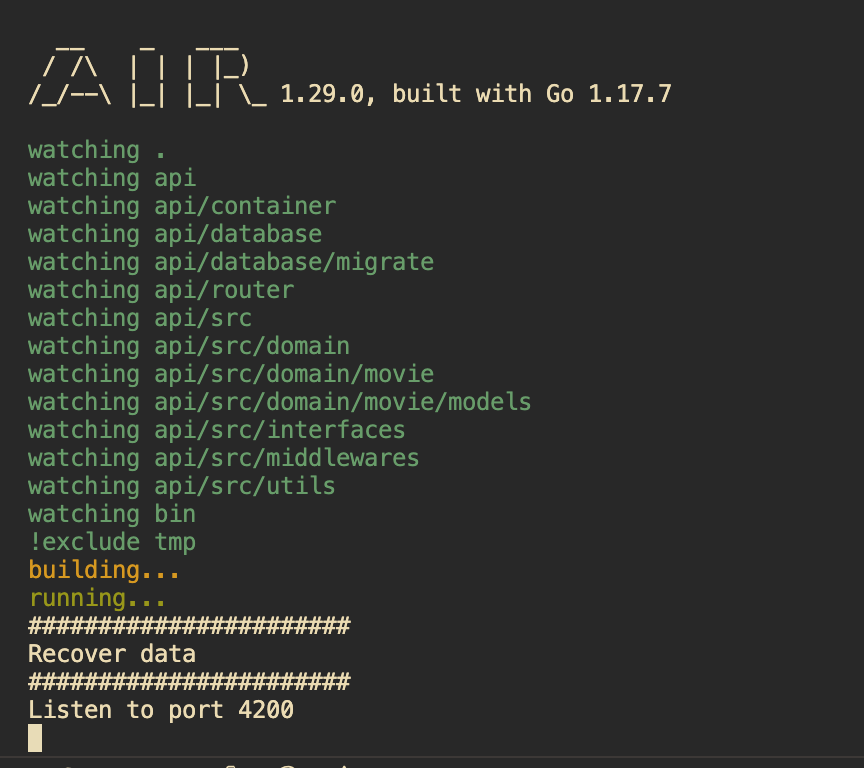

# Api client server

- Partcipant: **Titouan Escorneboueü**
- Langage front: **React TypeScript**
- Langage back: **Golang**
- Database: **PostgreSQL**

---

## Front

Pour l'utilisation front du projet pas de besoin spécifique. Il vous suffit de vous placer dans le dossier **client** :

```
cd client
```

Puis de lancer la commande :

```
npm start
```

Et vous serez re-dirigé vers le site web.
Ayant fait le style en **Mobile First** il est préférable d'ouvrir l'inspecteur d'élément et de changer de screen.

---

## Back

Pour l'utilisation du back, il vous faudra plusieurs installation que je vais vous décrire :

- Database :  
  Pour la base de donnée vous devrez (si ce n'est pas déjà le cas) installer PostgreSQL sur votre ordinateur.

  - Windows
    Lien pour l'installation de PostgreSQL sur Windows [cliquez ici](https://www.postgresql.org/download/windows/)

  - Linux
    Lien pour l'installation de PostgreSQL sur Linux [cliquez ici](https://www.veremes.com/installation-postgresql-linux)

    - Macos
      Pour l'installation sur macos il y a plusieurs façon de faire cela :
      - Via HomeBrew (gestionnaire de package sur Mac) :
        `brew install postgresql`
      - Via le site PostgreSQL :
        [cliquez ici](https://www.postgresql.org/download/macosx/)

    Une fois PostgreSQL installé, le mieux et d'installer PgAdmin4 (interface pour PostgreSQL)

    - Windows
      Lien pour l'installation de PgAdmin 4 [cliquez ici](https://www.pgadmin.org/download/pgadmin-4-windows/)

    - Linux
      Lien pour l'installation de PgAdmin 4 [cliquez ici](https://devstory.net/11353/installer-pgadmin-sur-ubuntu)

    - Macos
      Lien pour l'installation de PgAdmin 4 [cliquez ici](https://www.pgadmin.org/download/pgadmin-4-macos/)

Une fois PostgreSQl et PgAdmin 4 d'installé vous devez créer la base de donnée qui vas stocker les films.

Si vous regarder bien dans le dossier server, il y a un fichier **.env.example**. Pour la sécurité des données j'ai ignoré le fichier **.env**, ça sera à vous de le créer et avec l'example remplire les variable avec les données obligatoire pour la bon fonctionnement de l'API.

Si vous avez installer PostgreSQl sans avoir modifié vous aurez donc ces valeurs là par défaut :

- User = **postgres**
- Password = **postgres**
- Port = **5432** (le port par défault de PostgreSQL)
- Host = **localhost** (car votre base de donnéest en local)

La base de donnée crée et le fichier .env crée, il faut maitenant créer la table qui vas contenir les films.  
Pour cela si sur PgAdmin faite un clique droit sur votre base de donnée, séléctionner **Query Tools** -> ouis importer le fichier **server/api/database/migrate/tables.sql**. Cela vas créer la tables "movies".

Une fois fini, vous pouvez passer sur l'API. Comme pour le fichier .env, j'ai ignoré les fichiers intrinsèque à Go (go.mod, go.sum).

Pour les récupérer plus facilement j'ai créé un fichier **Makefile**.

1. Pour initialiser les modules de Go vous devrez lancer la commande :

```
make init-p
```

2. Pour installer le package Air (hot loading pour Go) :

```
make air
```

3. Pour lancer Air :

```
make watch
```

Une fois c'est manipulation faite vous devrai avoir cela dans votre terminal :  


Si vous avez bien cela dans votre terminal, il vous rest plus qu'à profite du site.
